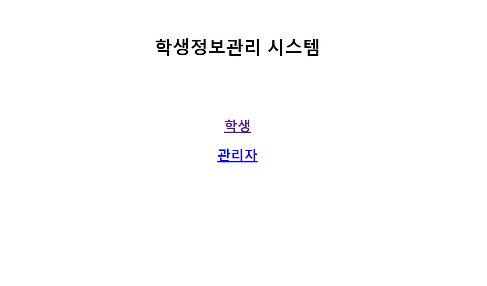
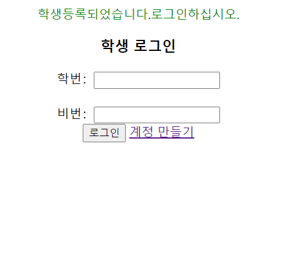
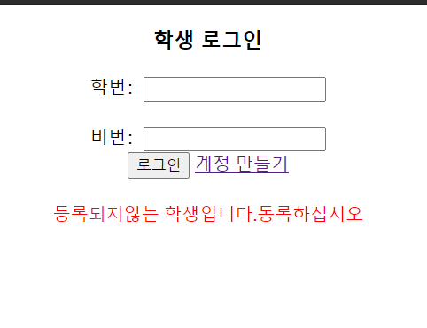
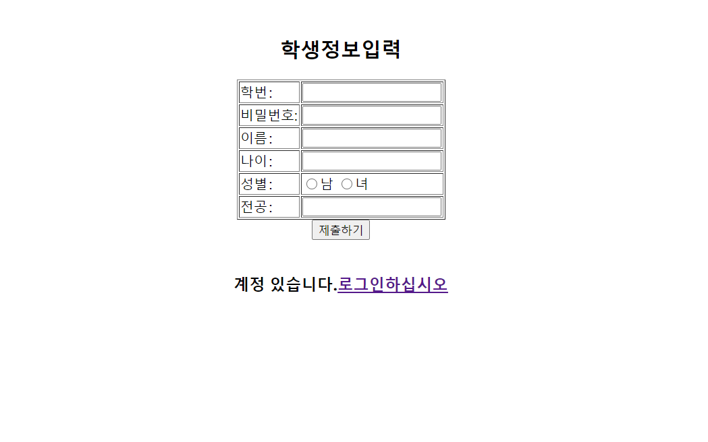
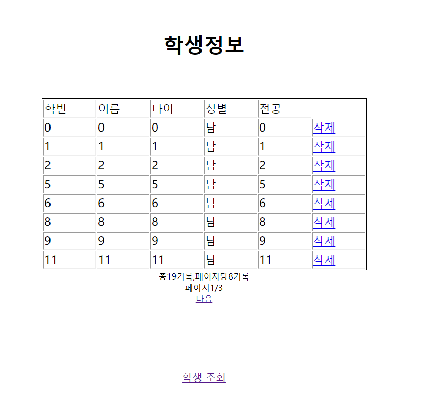
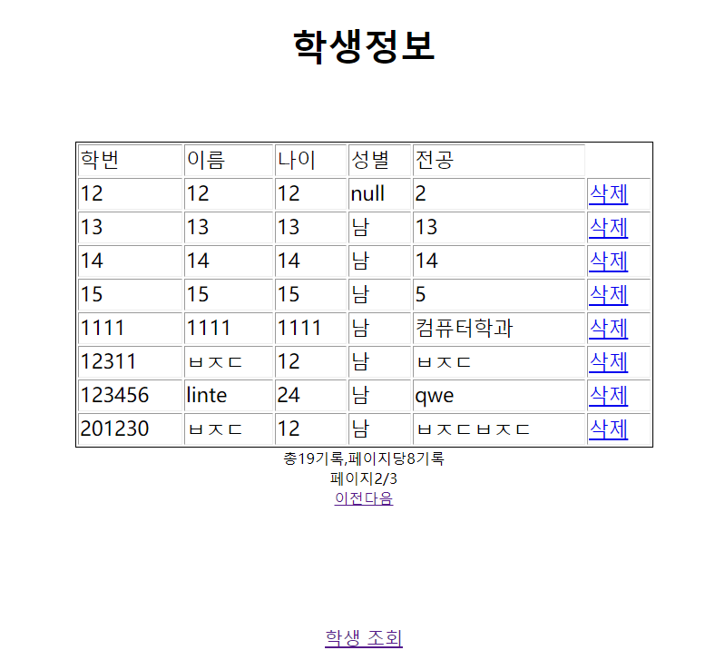
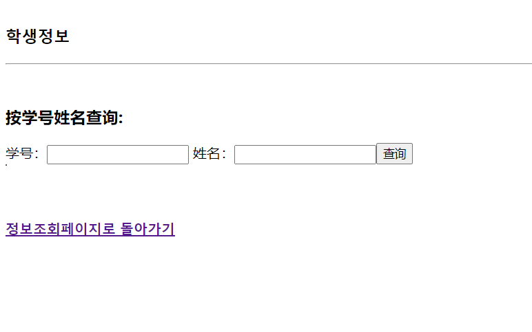

# jsp-studentmanagement-demo

jsp/servlet超简易学生管理系统 
非常简单 麻雀虽小但是五脏俱全 （如果没有session的五脏也是全五脏哈哈哈）

2019년 jsp등 새롭지 않은 기술(- -)을 배우면서 이 프로젝트 3주동안 완성했습니다.
jsp/servlet 기반 엄청 기본적이고 간단한 학생정보 시스템demo~ 

환경:
tomcat 8.5
mysql/navicat 
eclipse jee

MVC모형 
model:student admin(바로 설정했음)
view: login registor등 14개 jsp파일 
control: 여러까지 servlet파일 

# Index 

# 로그인 

# 로그인 실패시 

# registor

# 로그인 성공시 

# admin (default 아이디:admin 비번:admin) 등록후 학생전체보기 여기 페이지나누는 기능 있음 

# admin 학생을 보고 학번 이름에 따라 학생을 검색

# 还有一些退出的页面我就不po了~哈哈惭愧惭愧
